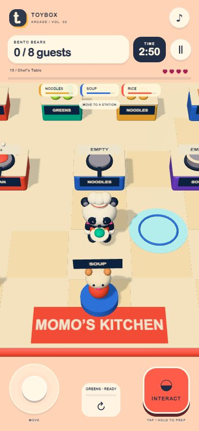

# Bento Bears

Bento Bears (熊猫便当店) is a standalone Toybox Arcade game with brighter rounded 3D toy art, a redesigned character, English UI, mobile controls and 15 evolving stages. Version 1.0.1.

**[Play online](https://wentaopeng714-cmd.github.io/bento-bears/) · [Download the complete ZIP](https://github.com/wentaopeng714-cmd/bento-bears/releases/download/v1.0.1/bento-bears-v1.0.1.zip)**



## Play locally

Run `npm start` with Node.js and open **http://localhost:4200/** (this game opens directly at `/`). The compiled bundle is included: no package installation or build is needed to play. Serve through HTTP; opening the HTML directly as a file is not supported. `PORT` overrides 4200.

| Game | Rules | New mechanics over 15 levels |
| --- | --- | --- |
| [Bento Bears](./) | Move between ingredient bins, PREP, cookers and guests. Tap INTERACT to take, cook, collect and serve; hold at PREP to chop. | Multiple recipes and cookers, chopping, ready-food expiry, soup, spills, a moving preparation trolley and three simultaneous guests. Plan parallel jobs. Four kitchen mishaps end an attempt. |

Use the left joystick and right action button on phones. On desktop use **WASD / arrow keys** and **hold/release Space**. **Escape** pauses. For light puzzles, **1–9** rotates a mirror, **C** changes the source color and **G** toggles the sun shutter. The game also supports direct pointer clicks on mirrors and switches.

The start screen shows one mission at a time; tap its level card to open all 15 stages. Progress is saved locally as best stars per stage. Pausing or backgrounding the page freezes the simulation and clears input. Retry includes a new countdown. All game UI is English.

## Art and motion

Procedural rounded models preserve the miniature toy style and elevated view. Momo is a panda chef; Luma is a small antlered deer; Rue is a raccoon scout; Pip drives a tiny kart; Pepo is a penguin with a basket. Bigger heads, shorter noses, facial highlights, rounded paws and distinctive clothing make the characters readable at gameplay scale.

Coral, violet, turquoise, yellow and hot pink create stronger separation against cream and navy. Each game has its own dominant color. Character galleries, mission cards, a separate level picker, compact HUD, contextual cooking actions and large touch controls replace the previous centered level-grid layout.

Distance-based walking, ground contact, acceleration lean, spring reactions, blinking, accessory follow-through, cart drift trails, turbo particles, cooking steam, mirror turns, blooming flowers, following rescued ducks and fruit landing rings provide action feedback. Synthesized audio starts after interaction and can be muted. Models are generated locally in code; Three.js is bundled under the MIT license in `THREE-LICENSE.txt`.

## Development and verification

```sh
npm install
npm run build
npm test
```

- `src/catalog.js`: the shared five-game catalog, stage names and introduced mechanics.
- `src/sim.js`: independent rules, collisions, timers, patrol visibility and scoring.
- `src/view.js`: characters, scenes, cameras, animation and effects.
- `src/main.js`: navigation, touch/keyboard input, pause, progress and UI.
- `tests/game.test.mjs`: 16 behavior and progression checks.
- `tests/route-pilots.mjs`: all 75 routes completed through movement and action inputs. Light puzzles are solved through their normal turning commands. No route pilot teleports the player.

All 16 checks pass, including the 75-route feasibility check. Browser verification covers desktop, 390 × 844 and 320 × 568 layouts, starting, 15-stage selection, actual pointer mirror turns and a puzzle clear, result navigation, touch release, pause and retry. Simulation success establishes reachability and basic time feasibility, not human difficulty or physical-phone performance. The shared engine contains all five games; this entry selects Bento Bears. This game is single-player and do not have online multiplayer.

Developer fixtures use `?verify=1`, optionally `&level=15`, `&demo=action&still=1`, `&demo=win` or `&demo=loss`. Fixtures never save progress. Normal game URLs begin at normal start menus. Screenshots in `previews/` include browser captures of these visual fixtures.
